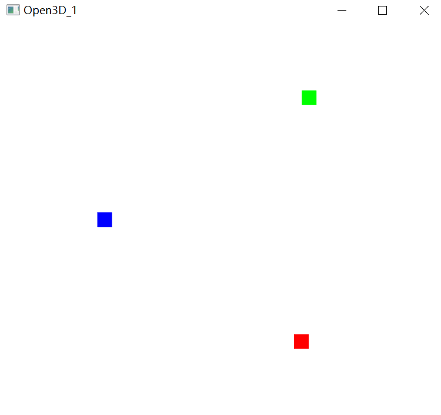
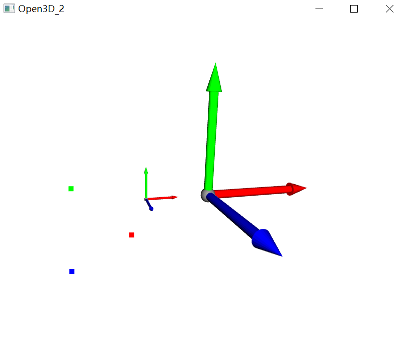
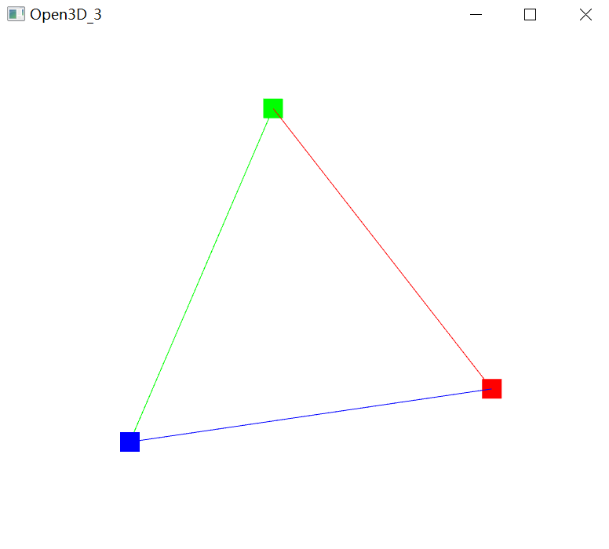

## open3d_basic

### 1. 绘制3d点点云

```python
import open3d
import numpy as np

points = np.array([[0.1, 0.1, 0.1], [1, 0, 0], [0, 1, 0], [0, 0, 1]])
colors = [[1, 1, 1], [1, 0, 0], [0, 1, 0], [0, 0, 1]] # RGB颜色

pointcloud = open3d.geometry.PointCloud()  # 定义点云对象

pointcloud.points = open3d.utility.Vector3dVector(points)  # 给这个点云对象添加点
pointcloud.colors = open3d.Vector3dVector(colors)  # 给每个点添加颜色

open3d.visualization.draw_geometries([pointcloud]) # 显示点云
```




### 2. 绘制3d点点云动态显示

```python
import open3d
import numpy as np

# 绘制open3d坐标系
axis_pcd = open3d.create_mesh_coordinate_frame(size=0.5, origin=[0, 0, 0])
axis_pcd1 = open3d.create_mesh_coordinate_frame(size=2, origin=[1, 0, 0])
# 在3D坐标上绘制点：坐标点[x,y,z]对应R，G，B颜色
points = np.array([[0.1, 0.1, 0.1], [1, 0, 0], [0, 1, 0], [0, 0, 1]])
colors = [[1, 1, 1], [1, 0, 0], [0, 1, 0], [0, 0, 1]]

test_pcd = open3d.geometry.PointCloud()  # 定义点云

# 方法1（非阻塞显示）
vis = open3d.Visualizer()
vis.create_window(window_name="Open3D_2")
vis.get_render_option().point_size = 10
first_loop = True
# 先把点云对象添加给Visualizer
vis.add_geometry(axis_pcd)
vis.add_geometry(axis_pcd1)
vis.add_geometry(test_pcd)
while True:
    # 给点云添加显示的数据
    points -= 0.001
    test_pcd.points = open3d.utility.Vector3dVector(points)  # 定义点云坐标位置
    test_pcd.colors = open3d.Vector3dVector(colors)  # 定义点云的颜色

    # update_renderer显示当前的数据
    vis.update_geometry()
    vis.poll_events()
    vis.update_renderer()
```



### 3. 绘制线段

```python
import open3d
import numpy as np

triangle_points = np.array([[1, 0, 0], [0, 1, 0], [0, 0, 1]], dtype=np.float32)
lines = [[0, 1], [1, 2], [2, 0]]  # 每条线由哪两个点组成
colors = [[1, 0, 0], [0, 1, 0], [0, 0, 1]]

# 定义三角形的三个角点
pointcloud = open3d.geometry.PointCloud()  # 定义点云
pointcloud.points = open3d.Vector3dVector(triangle_points)
pointcloud.colors = open3d.Vector3dVector(colors)

# 定义三角形三条连接线
line = open3d.LineSet()
line.lines = open3d.Vector2iVector(lines)
line.colors = open3d.Vector3dVector(colors)
line.points = open3d.Vector3dVector(triangle_points)

# show 
open3d.visualization.draw_geometries([pointcloud,line],window_name="Open3D_3")
```


### 4. ICP
[ICP](https://blog.csdn.net/weixin_42488182/article/details/105196148)