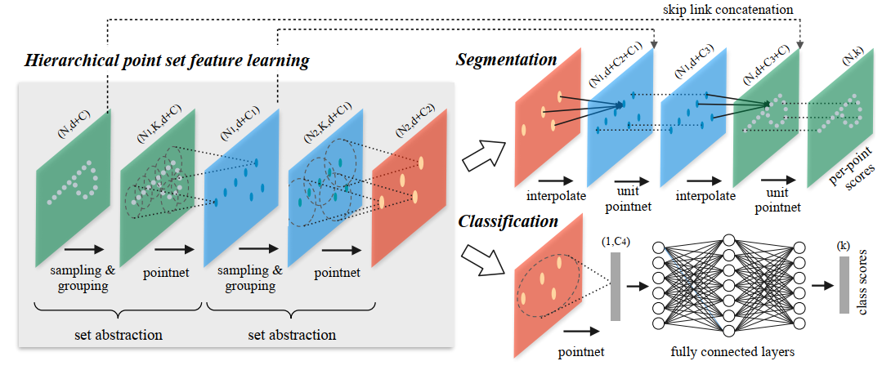
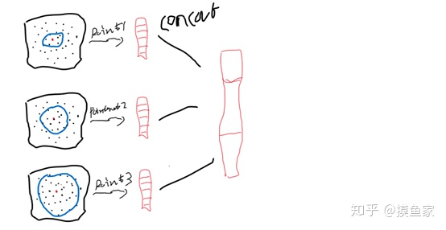

PointNet++是作者[Charles](http://stanford.edu/~rqi/)继PointNet之后的又一篇深度学习在三维点云上应用的经典之作。

论文地址：[PointNet++: Deep Hierarchical Feature Learning on Point Sets in a Metric Space](https://arxiv.org/abs/1706.02413)

首先作者指出之前PointNet的缺点：

> However, by design PointNet does not capture local structures induced by the metric space points live in, limiting its ability to recognize fine-grained patterns and generalizability to complex scenes. 

PointNet并不能捕捉到由度量(metric)空间点所产生的局部结构，限制了网络对于细粒度(fine-grained)特征的识别和对于复杂场景下的泛化性(generalizability)

(这里加上理解)

PointNet++的原理：

> We first partition the set of points into overlapping local regions by the distance metric of the underlying space. Similar to CNNs, we extract local features capturing fine geometric structures from small
neighborhoods; such local features are further grouped into larger units and processed to produce higher level features. This process is repeated until we obtain the features of the whole point set.

(这里补一张图，那个A字的)

PointNet++需要解决的两个问题：

> 1.how to generate the partitioning of the point set
2.how to abstract sets of points or local features through a local feature learner

1. 怎么对点云进行划分
2. 怎么去通过一个局部的特征学习模块去抽象点云或者局部特征
   理解:第一次还是对点云进行学习，之后就是对局部特征进行学习

针对第二个问题：

> As a basic building block, PointNet abstracts sets of local points or features into higher level representations. In this view, PointNet++ applies PointNet recursively on a nested partitioning of the input set.

使用PointNet作为local feature learner来提取特征

针对第一个问题：

> Each partition is defined as a neighborhood ball in the underlying Euclidean space, whose parameters include centroid location and scale. To evenly cover the whole set, the centroids are selected among input point set by a farthest point sampling (FPS) algorithm.

通过FPS来获取球域的中心(centroid)

补一张FPS的图

那么球域的scale呢？这里就有问题了，因为点云是不均匀的，entanglement of feature scale ？？？(特征的尺度也是不一样的)，第一次是点云，之后是特征？？？

> Deciding the appropriate scale of local neighborhood balls, however, is a more challenging yet intriguing problem, due to the entanglement of feature scale and non-uniformity of input point set.

作者还把local partition scale与CNN中的kernels size做了表比较

> Our input point set is thus very different from CNN inputs which can be viewed as data defined on regular grids with uniform constant density. In CNNs, the counterpart to local partition scale is the size of kernels. [25] shows that using smaller kernels helps to improve the ability of CNNs. Our experiments on point set data,however, give counter evidence to this rule. Small neighborhood may consist of too few points due to sampling deficiency, which might be insufficient to allow PointNets to capture patterns robustly.

比如CNN应用的图像数据pixel都是regular grids with uniform constant density，然而点云的密度是不均匀的。同时CNN中使用小的卷积核效果好，但是在点云中，小的球域导致了采样点的减少，PointNets就不能很好的获取特征(其实本质还是点云不均匀，不像图像那样)

解决方法：

>A significant contribution of our paper is that PointNet++ leverages neighborhoods at multiple scales to achieve both robustness and detail capture. Assisted with random input dropout during training,the network learns to adaptively weight patterns detected at different scales and combine multi-scale features according to the input data

对于centroid点的邻域使用了multiple scales，同时在训练的时候还会人为随机减少输入点，让网络更鲁棒
底下再详细介绍

PointNet++的网络结构

> Our hierarchical structure is composed by a number of set abstraction levels . At each level, a set of points is processed and abstracted to produce a new set with fewer elements. The set abstraction level is made of three key layers: Sampling layer, Grouping layer and PointNet layer. 

> The Sampling layer selects a set of points from input points, which defines the centroids of local regions. Grouping layer then constructs local region sets by finding “neighboring” points around the centroids. PointNet layer uses a mini-PointNet to encode local region patterns into feature vectors.

> Sampling layer.

> Grouping layer.
> Ball query finds all points that are within a radius to the query point.

> PointNet layer.
> In this layer, the input are N0 local regions of points with data size N0×K×(d+C).
Each local region in the output is abstracted by its centroid and local feature that encodes the centroid’s neighborhood. Output data size is N0 × (d + C0)

对于非均匀点云的处理方法

> Multi-scale grouping (MSG).

> Multi-resolution grouping (MRG).

 text 

问题：
1. metric space 
   这里理解为3d空间 Euclidean space
   
2. fine-grained 细粒的
   简单来说fine-grained就是细粒度，fine-grained classification是细粒度的图像分类。与coarse-grained classification（粗粒度）相比，粗粒度是分辨是猫还是狗——细粒度是分辨狗这个类别下，这张图是1.吉娃娃还是2.萨摩耶还是n.哈巴狗
    链接：https://www.zhihu.com/question/299171510/answer/515820188

3. MRG的理解

在PointNet中，一个显著的问题是对于局部特征问题的处理，在原PointNet中，对于part segmentation以及scene semantic sparsing，即需要得到每个点的得分时，处理办法是直接将点特征与全局特征结合到一块进行处理，忽略了局部特征这一中间步骤，例如在一个场景中，我们先识别出椅子是椅子，桌子是桌子等这些局部特征，是否在最终对每个点进行分类时，是否会更加准确呢，所以PointNet++采用了分层的结构用于处理局部特征，用论文中的词来描述就是可以更好的处理fine-grained patterns，而在PointNet中，并没有进行分层处理，所以PointNet++对这一部分工作进行了完善。

