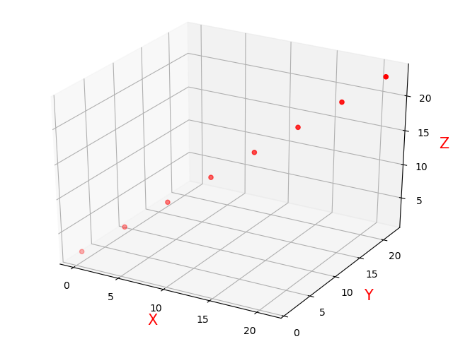

## python画图可视化

### 1. matplotlib绘制三维散点图

```python
import numpy as np
import matplotlib.pyplot as plt
from mpl_toolkits.mplot3d import Axes3D  # 空间三维画图

# 数据
data = np.arange(24).reshape((8, 3))

x = data[:, 0]
y = data[:, 1]
z = data[:, 2]

# 绘制散点图
fig = plt.figure()
ax = Axes3D(fig)
ax.scatter(x, y, z, c='r', label='随机点')

# 添加坐标轴(顺序是Z, Y, X)
ax.set_zlabel('Z', fontdict={'size': 15, 'color': 'red'})
ax.set_ylabel('Y', fontdict={'size': 15, 'color': 'red'})
ax.set_xlabel('X', fontdict={'size': 15, 'color': 'red'})
plt.show()
```




