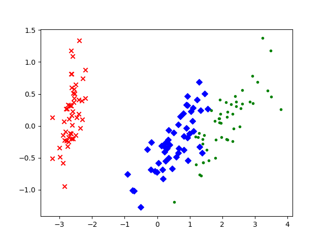

## Python sklearn库实现PCA（以鸢尾花分类为例）

> 通过Python的sklearn库来实现鸢尾花数据进行降维，数据本身是4维的降维后变成2维，可以在平面中画出样本点的分布。样本数据结构如下:

| 萼片长度 | 萼片宽度 | 花瓣长度  | 花瓣宽度 | 类别 |
| :---:|:---:| :--:|:---:|:-----------:|
| 5.1  | 3.5 | 1.4 | 0.2 | lris-setosa |
| 4.9  | 3.0 | 1.4 | 0.2 | lris-setosa |

```python
import matplotlib.pyplot as plt                 #加载matplotlib用于数据的可视化
from sklearn.decomposition import PCA           # 加载PCA算法包
from sklearn.datasets import load_iris

data=load_iris()
y=data.target
x=data.data

pca = PCA(n_components=4) # 先不降维，只对数据进行投影，看看投影后的4个维度的方差分布
pca.fit(x)
print('variance_: ', pca.explained_variance_)
print('variance_ratio_: ', pca.explained_variance_ratio_)

pca=PCA(n_components=2)     # 加载PCA算法，设置降维后主成分数目为2
reduced_x=pca.fit_transform(x) # 对样本进行降维

red_x,red_y=[],[]
blue_x,blue_y=[],[]
green_x,green_y=[],[]

for i in range(len(reduced_x)):
    if y[i] ==0:
        red_x.append(reduced_x[i][0])
        red_y.append(reduced_x[i][1])

    elif y[i]==1:
        blue_x.append(reduced_x[i][0])
        blue_y.append(reduced_x[i][1])

    else:
        green_x.append(reduced_x[i][0])
        green_y.append(reduced_x[i][1])

# 可视化
plt.scatter(red_x,red_y,c='r',marker='x')
plt.scatter(blue_x,blue_y,c='b',marker='D')
plt.scatter(green_x,green_y,c='g',marker='.')
plt.show()
```


